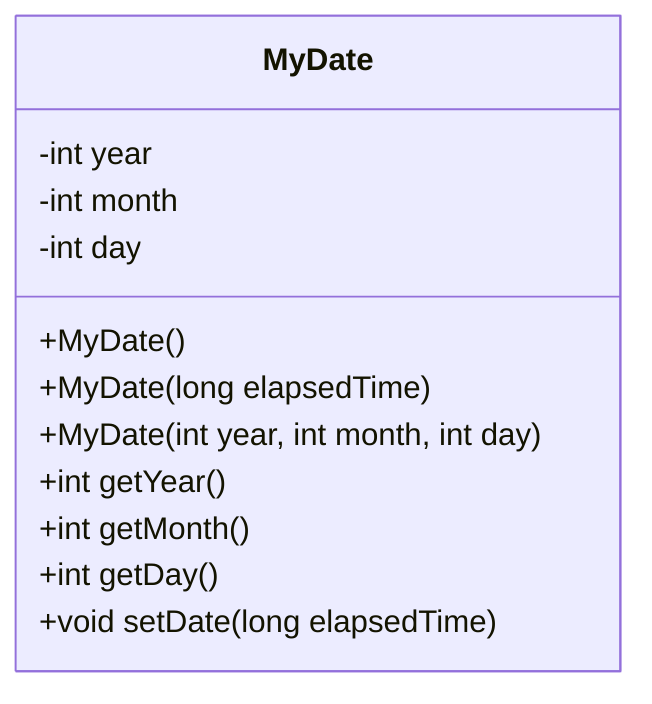

# Exercise 10.14 - UML

## UML Diagram

```mermaid
classDiagram
    class MyDate {
        -int year
        -int month
        -int day
        +MyDate()
        +MyDate(long elapsedTime)
        +MyDate(int year, int month, int day)
        +int getYear()
        +int getMonth()
        +int getDay()
        +void setDate(long elapsedTime)
    }
```