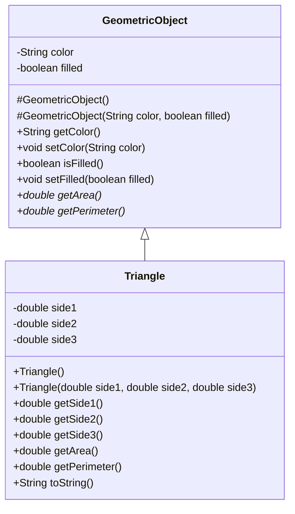

# Exercise 11.1 - Triangle Class

## UML Diagram 

```mermaid
classDiagram
    class GeometricObject {
        -String color
        -boolean filled
        #GeometricObject()
        #GeometricObject(String color, boolean filled)
        +String getColor()
        +void setColor(String color)
        +boolean isFilled()
        +void setFilled(boolean filled)
        +double getArea()*
        +double getPerimeter()*
    }

    class Triangle {
        -double side1
        -double side2
        -double side3
        +Triangle()
        +Triangle(double side1, double side2, double side3)
        +double getSide1()
        +double getSide2()
        +double getSide3()
        +double getArea()
        +double getPerimeter()
        +String toString()
    }

    GeometricObject <|-- Triangle
```