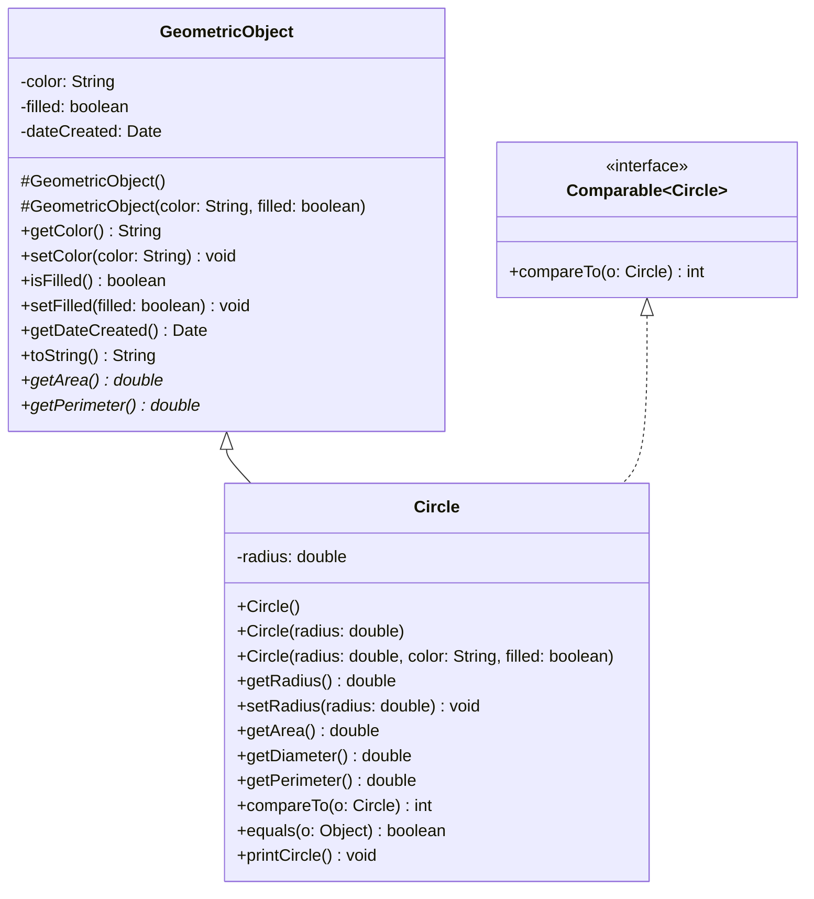

```mermaid
classDiagram
    class Comparable~Circle~ {
        <<interface>>
        +compareTo(o: Circle) int
    }

    class GeometricObject {
        -color: String
        -filled: boolean
        -dateCreated: Date
        #GeometricObject()
        #GeometricObject(color: String, filled: boolean)
        +getColor() String
        +setColor(color: String) void
        +isFilled() boolean
        +setFilled(filled: boolean) void
        +getDateCreated() Date
        +toString() String
        +getArea()* double
        +getPerimeter()* double
    }

    class Circle {
        -radius: double
        +Circle()
        +Circle(radius: double)
        +Circle(radius: double, color: String, filled: boolean)
        +getRadius() double
        +setRadius(radius: double) void
        +getArea() double
        +getDiameter() double
        +getPerimeter() double
        +compareTo(o: Circle) int
        +equals(o: Object) boolean
        +printCircle() void
    }

    GeometricObject <|-- Circle
    Comparable~Circle~ <|.. Circle
```